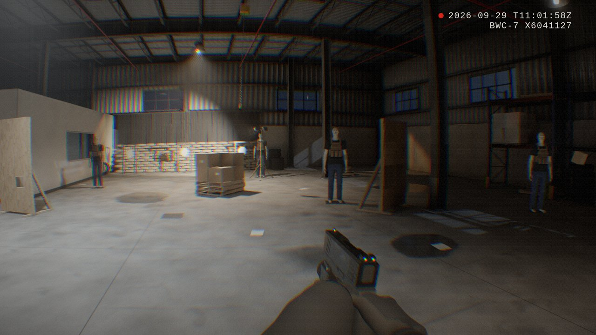
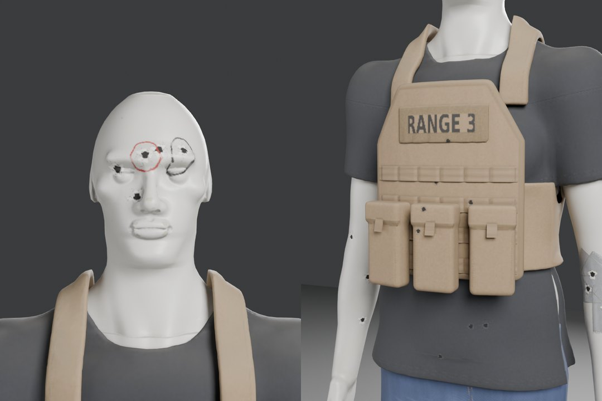
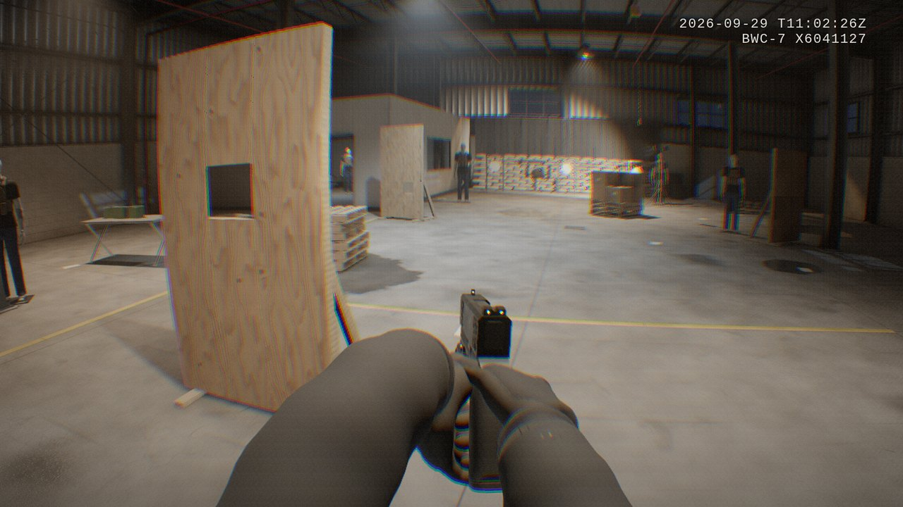

# DeadFace: bodycam shooter prototype

A photorealism-first bodycam shooter built with **Three.js**, **Rapier** physics,
**Vite + TypeScript** and a code-only **Blender** asset pipeline.

It's night in "Range 4", a warehouse fitted out as a shooting range. You have a
pistol with a weapon light, six training mannequins in plate carriers (one on a
moving track), swinging steel plates and loose cans and boxes to knock about.



| | |
| --- | --- |
|  |  |

## Run it

```bash
npm install
npm run dev          # open the printed URL, click to start
npm run build        # static build in dist/ (any static host works)
```

`npm run package:artifact` also writes `dist-artifact/`, a variant for locked-down
hosts that only serve common web file types and only let the page fetch its own
files: models, the level and the HDR probe ship as base64 JSON that the game
decodes itself, every asset gets a content-hashed name, and the asset manifest
and CSS are inlined into the page. That is what the hosted claude.ai build uses.
If any file fails to load, the start screen lists it.

Controls: WASD move, Shift sprint, C crouch, Space hop, mouse look, left click
fire, right mouse raise/aim, R reload, F weapon light, H toggle ammo + dot,
T reset props, 1/2/3 post-FX quality, Esc pause. `?oldlevel` loads the older
procedural range instead of the baked warehouse.

## What makes it look real

| | Where |
| --- | --- |
| **Baked global illumination.** The warehouse is modelled and lit in Blender and baked with Cycles into a lightmap, plus a wet/grime/specular-occlusion mask and an HDR reflection probe. Lamps are "mixed": direct light and shadows run in real time, their bounce comes from the bake. | `blender/build_level.py`, `src/game/bakedLevel.ts`, `levelShading.ts` |
| **Box-projected, normalised reflections.** One probe, projected onto the hall and dimmed wherever the surface is darker than the probe spot, so corners and the office don't glow. Moving objects take their ambient level from the lightmap under them. | `levelShading.ts`, `bakedLevel.ts` |
| **Camera pipeline.** HDR + MSAA, raymarched volumetric light shafts through the lamps' shadow maps, energy-conserving bloom, GPU auto exposure, AgX tone curve. | `src/engine/postfx.ts` |
| **Bodycam lens and sensor.** Barrel distortion with per-channel chromatic aberration, motion blur from camera rotation, over-sharpening, shadow-weighted grain, vignette, timestamp overlay. | `src/engine/BodycamShader.ts` |
| **Hero assets.** Hard-surface pistol with machined bevels; gloved hands posed on the grip by a grasp solver; mannequins sculpted as distance fields with exactly baked detail normals, bullet damage, duct tape and marker, stitching and name tapes. All with baked 2K PBR atlases. | `blender/make_pistol.py`, `make_hands.py`, `make_mannequin.py` |
| **Movement and weapon feel.** Chest-mounted camera height, rotational inertia, gait bob, strafe roll, landing dip, recoil springs, muzzle climb, weapon lag, wall-proximity muzzle raise. | `src/game/player.ts`, `weapon.ts` |
| **Audio.** Synthesized gunshot crack/body/thump through a waveshaper + compressor into a concrete reverb: the clipped cheap-mic sound of real bodycam footage. | `src/engine/audio.ts` |

Gameplay: hitscan shots via Rapier ray casts against exact triangle colliders
for the level and per-part colliders on the mannequins (refined against the
visible mesh), bullet holes that stick to moving objects, sparks, dust and
debris, physics shell casings, mannequins that topple and stand back up,
pendulum steel plates, a 15-round magazine with a timed reload.

## Layout

```
src/
  main.ts                 bootstrap + frame loop
  engine/                 renderer, post FX, physics wrapper, input, audio, asset loading
  game/                   baked level + shading, player, weapon, targets, effects, procedural fallbacks
blender/                  asset pipeline (see docs/PIPELINE.md)
public/models/*.glb       models exported by the pipeline (meshopt-compressed where large)
public/level/             warehouse: level.glb, level.json, lightmap, mask, reflection probe
public/textures/*.jpg     tiling PBR sets (albedo / normal / roughness)
public/assets.json        manifest the game reads; anything missing falls back to procedural
tools/                    smoke test, screenshot views, artifact packaging
```

## Assets

Everything visual is generated by code, either in the game or by the Blender
scripts. The one outside input is the MIT-licensed WebXR hand mesh the glove
model starts from (`blender/assets/hands`). Rebuild with:

```bash
npm run assets          # needs `blender` on PATH (4.2+; tested with 5.0)
npm run assets:bpy      # or: pip install bpy (Python 3.11), no Blender install needed
npm run level:bpy       # the warehouse and its lightmap bake (slow)
```

[docs/PIPELINE.md](docs/PIPELINE.md) covers each script, the conventions the
game relies on, and how to swap in scanned materials or hand-made models.

## Testing

```bash
npm run typecheck
npm run smoke                              # headless Chromium; CHROMIUM=/path/to/chrome if needed
node tools/shots.mjs spawn dummy range     # named camera views -> screenshots/
```

The smoke test renders the demo loop, then aims at the nearest mannequin and
fires until it drops, and fails on any console error. `?demo` in the URL runs
the automatic look-around + fire loop without pointer lock.

## Next steps worth doing

- Enemy AI on a navmesh (recast-navigation-js) with rigged, animated characters.
- An armature for the hands, with reload, inspect and draw animations.
- KTX2/Basis texture compression to cut download size and GPU memory.
- Recorded foley and impulse responses in place of the synthesized audio.
