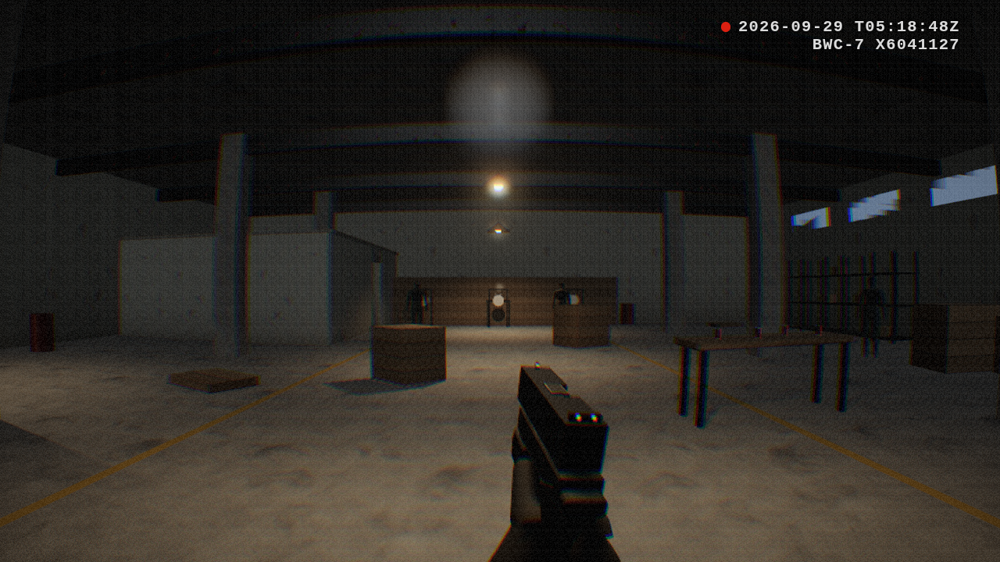

# Bodycam Shooter (prototype)

A first playable, photorealism-leaning bodycam shooter built with **Three.js**,
**Rapier** physics, **Vite + TypeScript**, and a **Blender** asset pipeline.

You spawn in a dim warehouse range with a pistol and a weapon light. There are
training mannequins (one on a moving track, one inside the back office),
swinging steel plates, and loose cans and boxes to knock around.



## Run it

```bash
npm install
npm run dev          # open the printed URL, click to start
npm run build        # static build in dist/ (any static host works)
```

Controls: WASD move, Shift sprint, C crouch, Space hop, mouse look, left click
fire, right mouse raise/aim, R reload, F weapon light, H toggle ammo + dot,
T reset props, 1/2/3 post-FX quality.

## What makes it look like bodycam footage

| Effect | Where |
| --- | --- |
| Barrel/fisheye lens with per-channel chromatic aberration | `src/engine/BodycamShader.ts` |
| Motion blur driven by camera angular velocity | shader `uBlur`, set in `src/main.ts` |
| Over-sharpening, sensor grain (stronger in shadows), vignette, desaturation | `BodycamShader.ts` |
| Chest-mounted camera height, rotational inertia, gait head bob, strafe roll, landing dip, breathing | `src/game/player.ts` |
| Recoil springs (camera + viewmodel), muzzle climb, weapon lag, wall-proximity muzzle raise | `src/game/weapon.ts` |
| Bloom on practical lights and muzzle flash, ACES tone mapping, HDR buffer + MSAA | `src/engine/renderer.ts` |
| Weapon-mounted light with shadows, flickering lamp, moonlit windows, fog | `src/game/level.ts` |
| Clipping cheap-mic audio: gunshot crack/body/thump into a waveshaper + compressor + concrete reverb | `src/engine/audio.ts` |
| Timestamp + device ID overlay | `index.html`, `src/style.css` |

Gameplay bits: hitscan bullets via Rapier ray casts, bullet-hole decals that
stick to moving objects, sparks/dust/debris particles, physics shell casings,
mannequins with head/torso/leg hit zones that ragdoll-topple and stand back up,
pendulum steel plates, 15-round mag with timed reload.

## Layout

```
src/
  main.ts                 bootstrap + frame loop
  engine/                 renderer + post, physics wrapper, input, audio, asset manifest
  game/                   level, player, weapon, targets, effects, procedural textures
blender/                  asset pipeline (see docs/PIPELINE.md)
public/models/*.glb       exported by the pipeline
public/textures/*.jpg     baked PBR sets (albedo / normal / roughness)
public/assets.json        manifest the game reads; anything missing falls back to procedural
tools/smoke.mjs           headless test: renders, fires at a mannequin, checks it drops
```

## Assets

Everything visual is either generated in code or by the Blender scripts, so
there are no licensing questions. Rebuild assets with:

```bash
npm run assets          # needs `blender` on PATH (4.2+; tested with 5.0)
npm run assets:bpy      # or: pip install bpy (Python 3.11), no Blender install needed
```

See [docs/PIPELINE.md](docs/PIPELINE.md) for conventions and how to swap in
scanned materials or hand-made models.

## Testing

```bash
npm run typecheck
npm run smoke           # headless Chromium; set CHROMIUM=/path/to/chrome if needed
```

`?demo` in the URL runs an automatic look-around + fire loop without pointer lock.

## Next steps worth doing

- Replace stand-in geometry with scanned/authored assets (the manifest makes it drop-in).
- Baked lightmaps or light probes from Blender for the static level (biggest realism jump).
- Enemy AI with navmesh (e.g. recast-navigation-js) and animation retargeting (Mixamo -> glTF).
- Hands with a real rig and reload/inspect animations authored in Blender.
- Recorded foley instead of synthesized audio.
